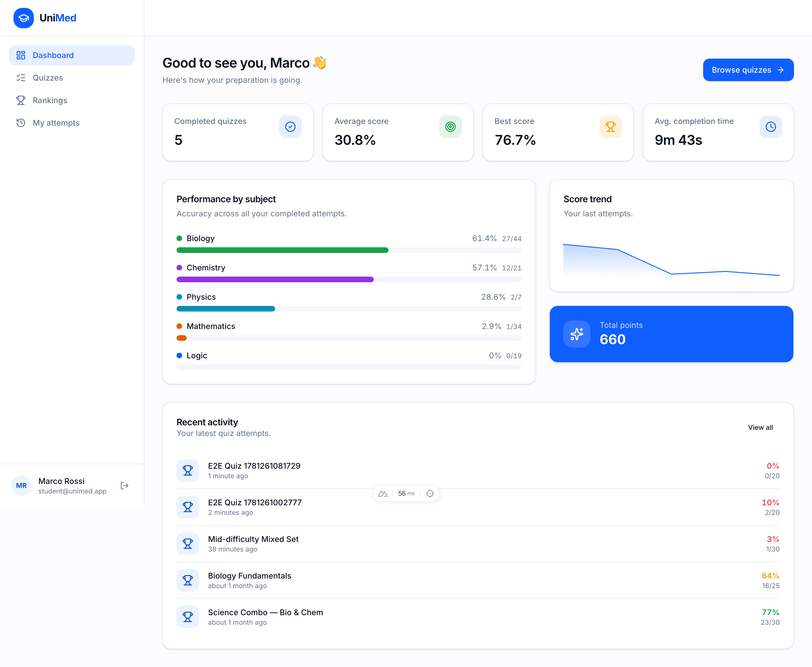
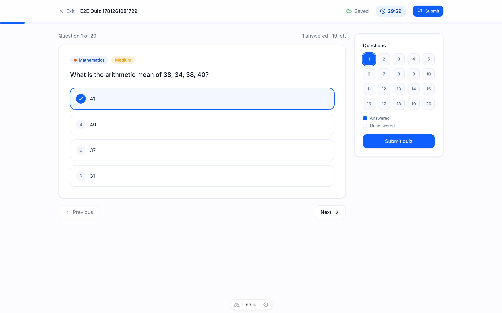
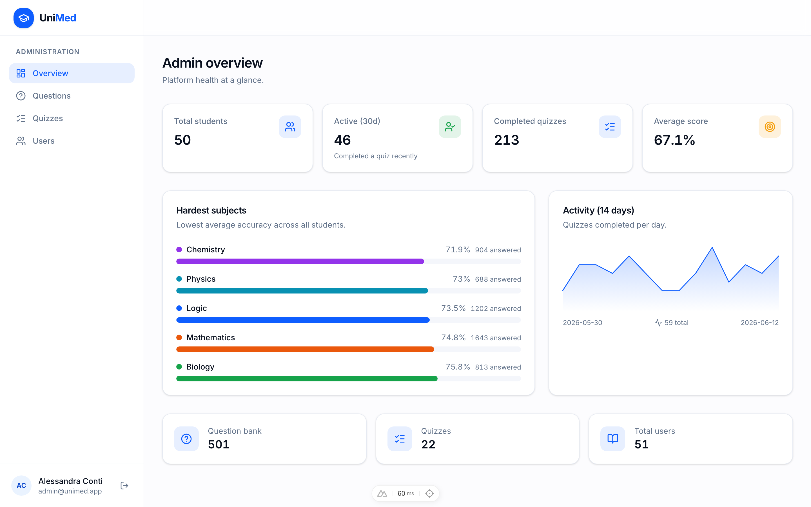

<div align="center">

# 🎓 UniMed

### The complete preparation platform for university admission exams

Realistic, timed exam simulations · per-subject analytics · national leaderboard — for **Medicine, Healthcare Professions & Veterinary** admission tests.

[](./.github/workflows/ci.yml)
&nbsp;·&nbsp; Laravel 12 · Nuxt 4 · PostgreSQL 17 · TypeScript · Tailwind CSS 4

</div>

---



UniMed is a production-quality MVP built as a real SaaS product: clean architecture, an excellent UI/UX, automated tests at every layer, Dockerised local development, and CI/CD ready for Railway + Vercel.

## ✨ Features

### For students
- **Realistic quiz simulation** — live timer, question navigator, single & multiple choice, **autosave**, and a submit confirmation. Resume an in-progress attempt at any time.
- **Dashboard** — KPI cards (completed quizzes, average / best score, average time), per-subject performance, score trend, and recent activity.
- **Detailed results** — score ring, correct / wrong / skipped breakdown, per-subject accuracy, and a full answer review with explanations.
- **Rankings** — a national leaderboard with your position, points and averages.
- **History** — revisit every completed attempt.

### For administrators
- **Analytics overview** — platform KPIs, hardest subjects, and a 14-day activity trend.
- **Question bank** — full CRUD with rich-text explanations, image uploads, filters (subject / difficulty / type) and search.
- **Quiz management** — build quizzes **manually** (hand-pick questions) or **auto-generate** them from filters; publish / unpublish; delete.
- **User management** — create, edit, disable/enable and search students & admins.

<table>
  <tr>
    <td width="50%"></td>
    <td width="50%"></td>
  </tr>
  <tr>
    <td align="center"><em>Live quiz simulation</em></td>
    <td align="center"><em>Admin analytics</em></td>
  </tr>
</table>

## 🧱 Tech stack

| Layer        | Technologies |
| ------------ | ------------ |
| **Backend**  | Laravel 12 · PHP 8.4 · PostgreSQL 17 · Redis · Sanctum · spatie/laravel-permission |
| **Frontend** | Nuxt 4 · Vue 3 (Composition API) · TypeScript · Pinia · VueUse · Tailwind CSS 4 · shadcn-vue (reka-ui) |
| **Testing**  | PestPHP · Vitest · Playwright |
| **Quality**  | Biome · Husky · lint-staged |
| **Infra**    | Docker · Docker Compose |
| **Deploy**   | Railway (backend) · Vercel (frontend) · GitHub Actions |

## 🗂️ Project structure

```
unimed/
├── apps/
│   ├── backend/        # Laravel 12 REST API (DDD-lite: Domain, Actions, Services)
│   └── frontend/       # Nuxt 4 SPA (Pinia, Tailwind 4, shadcn-vue, SVG charts)
├── docker/             # Dockerfiles + nginx config for the local stack
├── docs/               # Architecture, database (ERD), API, deployment
├── docker-compose.yml  # One-command local environment
└── .github/workflows/  # CI (lint, typecheck, tests, e2e, build) + deploy
```

## 🚀 Quick start (Docker — recommended)

The entire stack — PostgreSQL, Redis, the Laravel API (nginx + php-fpm), the Nuxt frontend and Mailpit — starts with a single command. Migrations and realistic demo data are seeded automatically on first boot.

```bash
docker compose up -d
```

Then open:

| Service            | URL                              |
| ------------------ | -------------------------------- |
| **Frontend (SPA)** | http://localhost:3000            |
| **API**            | http://localhost:8000/api        |
| **Mailpit (mail)** | http://localhost:8025            |

> First boot takes a minute while dependencies install and the database seeds (1 admin, 50 students, 500 questions, 20 quizzes, ~200 attempts).

### 🔑 Demo accounts

| Role    | Email                | Password   |
| ------- | -------------------- | ---------- |
| Admin   | `admin@unimed.app`   | `password` |
| Student | `student@unimed.app` | `password` |

The login screen also has one-click **“fill demo account”** buttons.

## 🛠️ Local development (without Docker)

Requires PHP 8.2+, Composer, Node 20+, pnpm 9, and PostgreSQL (or SQLite for a quick start).

```bash
# Backend
cd apps/backend
composer install
cp .env.example .env && php artisan key:generate
php artisan migrate --seed
php artisan serve            # → http://localhost:8000

# Frontend (in a second terminal, from the repo root)
pnpm install
pnpm --filter @unimed/frontend dev   # → http://localhost:3000
```

> For an even faster start, set `DB_CONNECTION=sqlite` in `apps/backend/.env` (the test suite already uses an in-memory SQLite database).

## 📜 Scripts (root)

| Command            | Description                              |
| ------------------ | ---------------------------------------- |
| `pnpm dev`         | Start the Nuxt dev server                |
| `pnpm build`       | Build the frontend for production        |
| `pnpm lint`        | Lint & format check (Biome)              |
| `pnpm lint:fix`    | Auto-fix lint & formatting               |
| `pnpm typecheck`   | Type-check the frontend                  |
| `pnpm test:fe`     | Run Vitest unit tests                    |
| `pnpm test:e2e`    | Run Playwright end-to-end tests          |

## ✅ Testing

| Suite              | Tooling     | Run |
| ------------------ | ----------- | --- |
| **Backend**        | PestPHP     | `cd apps/backend && ./vendor/bin/pest` |
| **Frontend unit**  | Vitest      | `pnpm --filter @unimed/frontend test` |
| **End-to-end**     | Playwright  | `pnpm --filter @unimed/frontend test:e2e` |

Backend tests cover authentication, authorization/policies, the quiz attempt lifecycle and the pure scoring engine. E2E covers the full student flow (login → quiz → results) and admin flow (login → create question → create quiz → analytics).

## 🔁 CI/CD

[`ci.yml`](.github/workflows/ci.yml) runs on every push & PR: **frontend** (Biome → typecheck → Vitest → build), **backend** (Pest + coverage), and **E2E** (Playwright against a PostgreSQL service). [`deploy.yml`](.github/workflows/deploy.yml) ships the backend to **Railway** and the frontend to **Vercel** on `main`.

Git hooks (Husky): **pre-commit** runs Biome via lint-staged; **pre-push** runs type-checking and the test suites.

## 📚 Documentation

| Doc | Description |
| --- | ----------- |
| [Architecture](docs/ARCHITECTURE.md) | Backend & frontend design, layering, request lifecycle |
| [Database](docs/DATABASE.md)         | Schema, ER diagram, indexing |
| [API reference](docs/API.md)         | Every REST endpoint |
| [Deployment](docs/DEPLOYMENT.md)     | Railway + Vercel + CI/CD setup |

## 📄 License

MIT © UniMed
